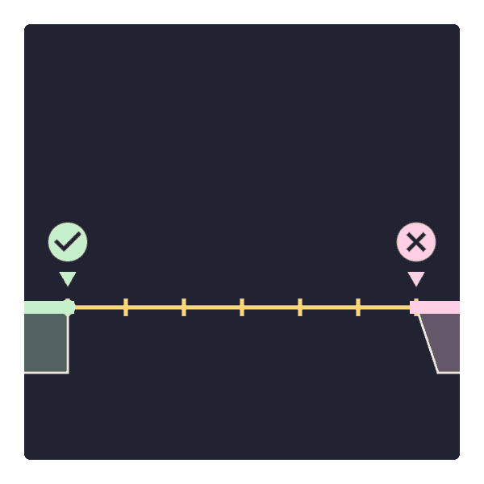

# pitorial
作ったアニメーションとそれを描くためのC++コードの置き場。
現状、このリポジトリに再利用可能なコードはなく、再利用可能にするための方策を色々考えている最中です。
アニメーションの描画には創造のための C++フレームワーク [OpenSiv3D](https://siv3d.github.io/ja-jp/)を用いています。

# 作例
from [https://x.com/for_i_in_loop/status/1851461936346775630](https://x.com/for_i_in_loop/status/1851461936346775630)

競技プログラミングの典型テクニックをGIFアイコン化してみる試み。

### 二分探索

### セグメントツリー

### ダブリング

