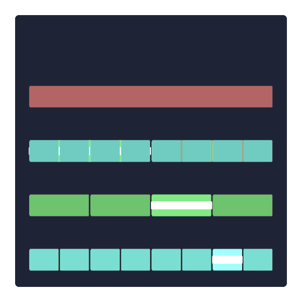

# pitorial
手軽にプログラミング関連の図やアニメーションを作るための実験用リポジトリ。
現状、このリポジトリに再利用可能なコードはなく、再利用可能にするための方策を検討しています。

# 作例
from [https://x.com/for_i_in_loop/status/1851461936346775630](https://x.com/for_i_in_loop/status/1851461936346775630)

競技プログラミングの典型テクニックをGIFアイコン化してみる試み。

### 二分探索

### セグメントツリー

### ダブリング

